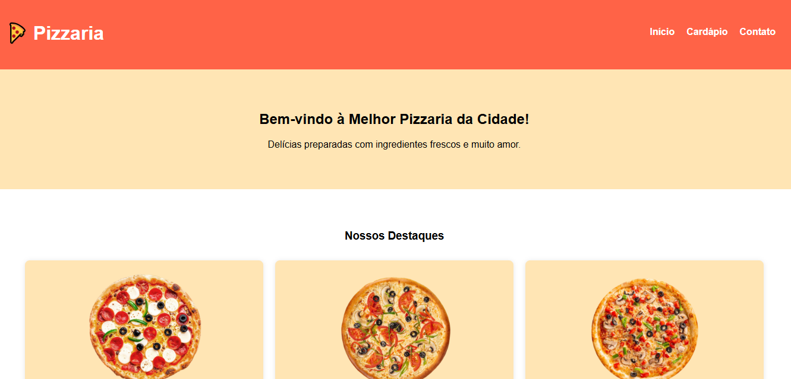
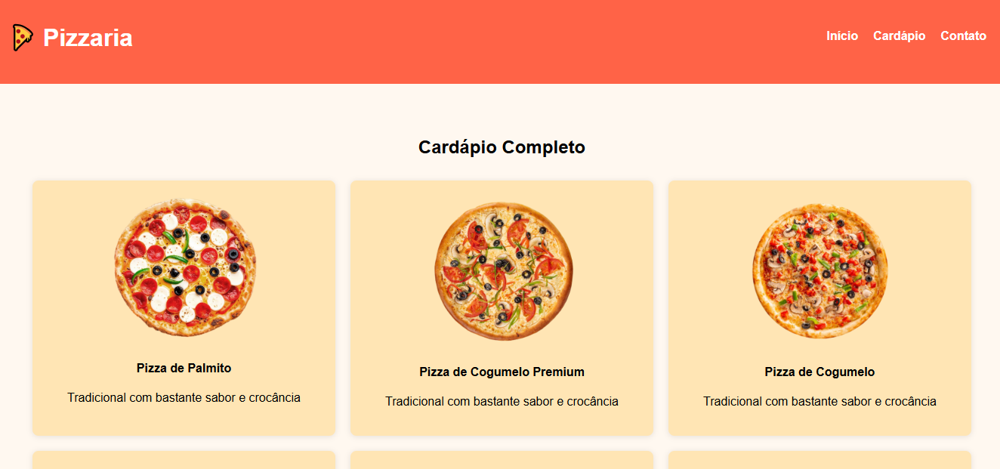
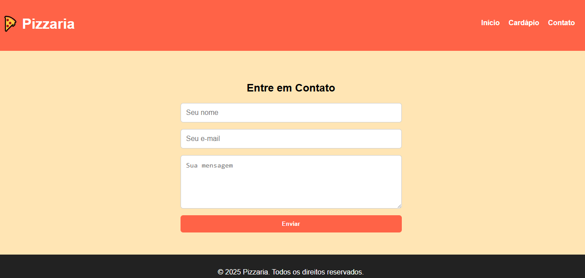

<!-- MODELO PROJETO EM ANDAMENTO -->
<h1 align="center"> 
	🚧 MD-Pizzaria-React - Em contrução 🚧
</h1>

<!-- 
<h1 align="center"> 
	  🚀✅ {Nome do repositório} - Concluído ✅🚀
</h1>
-->

 <a href="#-descrição-do-entregável">Descrição do Entregável</a> •
 <a href="#-sobre-o-projeto">Sobre</a> •
 <a href="#-funcionalidades">Funcionalidades</a> •
 <a href="#-layout">Layout</a> • 
 <a href="#-como-executar-o-projeto">Como executar</a> • 
 <a href="#-tecnologias">Tecnologias</a> • 
 <a href="#-autor">Autor</a> • 
 <a href="#user-content--licença">Licença</a>

## 📄 Descrição do entregável

- 🌐 MD-Pizzaria-React #
    - 🗂 src
        - 📁 assets
        - 📁 components
        - 📁 pages
        - 📄 App.jsx
        - 📄 main.jsx

---

## 💻 Sobre o projeto

<!-- EXPLICA O MOTIVO DO PROJETO -->
MD-Pizzaria-React é um projeto criado para praticar o uso do React Router dom.

---

## ⚙️ Funcionalidades

| Rota |  Descrição   |                       
|-----------------------------------------|-----------------------------------|
| `/`          | Exibe tela de inicio    |
| `/menu`          | Exibe tela de cardapio   |
| `/contact`          | Exibe tela de contato    |

---

## 🎨 Layout

- ###  Tela inicial

- ### Tela de cardápio

- ### Tela de contato

---

## 🚀 Como executar o projeto

1 - Baixar o Projeto  
`git clone https://github.com/maridabrins/MD-Pizzaria-React.git` 
2 - Instalar a pasta node_modules  
`npm install`
3 - Rodar o projeto  
`npm run dev`

### Pré-requisitos

Antes de começar, você vai precisar ter instalado em sua máquina as seguintes ferramentas:
[Git](https://git-scm.com), [Node.js](https://nodejs.org/en/) e. 
Além disto é bom ter um editor para trabalhar com o código como [VSCode](https://code.visualstudio.com/)

---

## 🛠 Tecnologias

As seguintes ferramentas foram usadas na construção do projeto:

#### **Front-End**  ([ReactJS](https://reactjs.org/)) 

-   **[React Router Dom](https://github.com/ReactTraining/react-router/tree/master/packages/react-router-dom)**
-   **[CSS](https://css.com/)**

---

## 🔨 Ferramentas: 

  
  
  

---

## 💪 Como contribuir para o projeto

1. Faça um **fork** do projeto.
2. Crie uma nova branch com as suas alterações: `git checkout -b my-feature`
3. Salve as alterações e crie uma mensagem de commit contando o que você fez: `git commit -m "feature: My new feature"`
4. Envie as suas alterações: `git push origin my-feature`
> Caso tenha alguma dúvida confira este [guia de como contribuir no GitHub](./CONTRIBUTING.md)

---

## 🦸 Autor

<a href="(https://www.linkedin.com/in/mariana-dabrins-95a971328/)">
Mariana Dabrins</a>
  
 

---

<!-- ---------------------------------------------------------------------- -->

<!-- MODELO DE LICENÇA -->
## 📝 Licença

Este projeto esta sobe a licença [MIT](./LICENSE).

Feito por Mariana Dabrins👋🏽 
